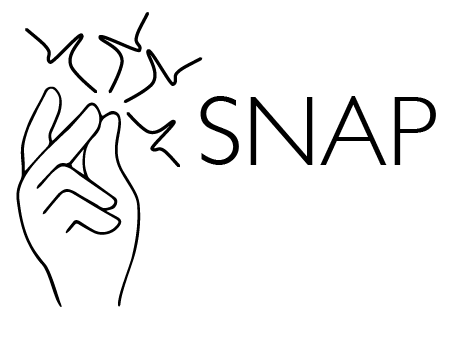

# [S]pectral theory of [N]eural [A]lignment and [P]rediction, aka **SNAP Theory**
This repository contains code accompanying: A Spectral Theory of Neural Prediction and Alignment. Abdulkadir Canatar∗, Jenelle Feather∗, Albert J. Wakhloo, & SueYeon Chung. NeurIPS 2023. (Spotlight). ∗Denotes equal contribution
